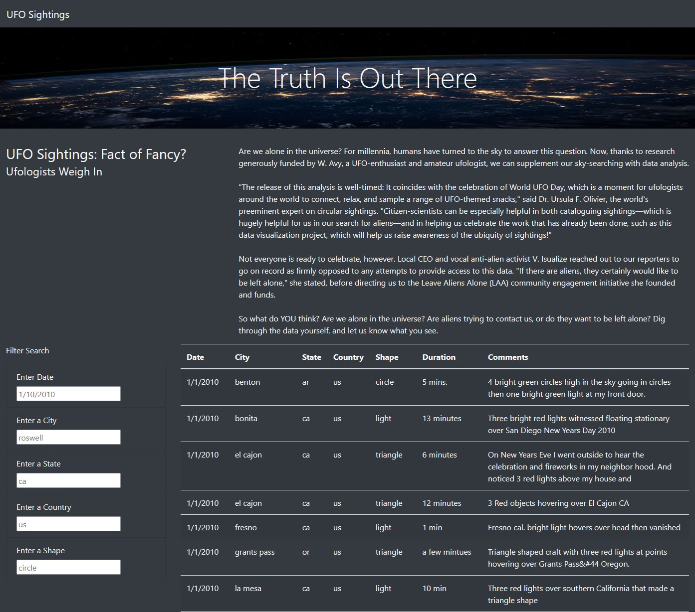
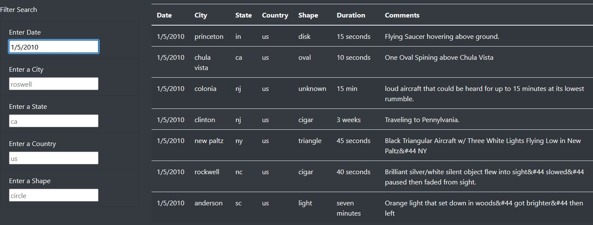

# UFOs
---

## Overview 
Create a table to organize UFO data that is stored as a JavaScript array, or list. This table will have the ability to filter data based on certain criteria and will be created using JavaScript as the primary coding language.

---

## Results
Using this webpage you can filter database data using the "Filter Search" section on imported data for UFO sitghtings. The webpage is formated as is below. 

Once filtered the data will show up as follows. Below all values for the date 1/5/2010 are shown

---

## Summary
There are a few limitations to this webpage. One noticable issue is that partial matches wont show, only exact matches. Another is that we are working with only imported data from US sightings, rendering the "Country" search pretty useless.

A few recomendations for changing this are to add data for multiple countries, and add functionality for partial matches. We could add more worldwide data here to bring more function into our search parameters. We could also add a legend of Shapes used so individuals could search easier as well. 